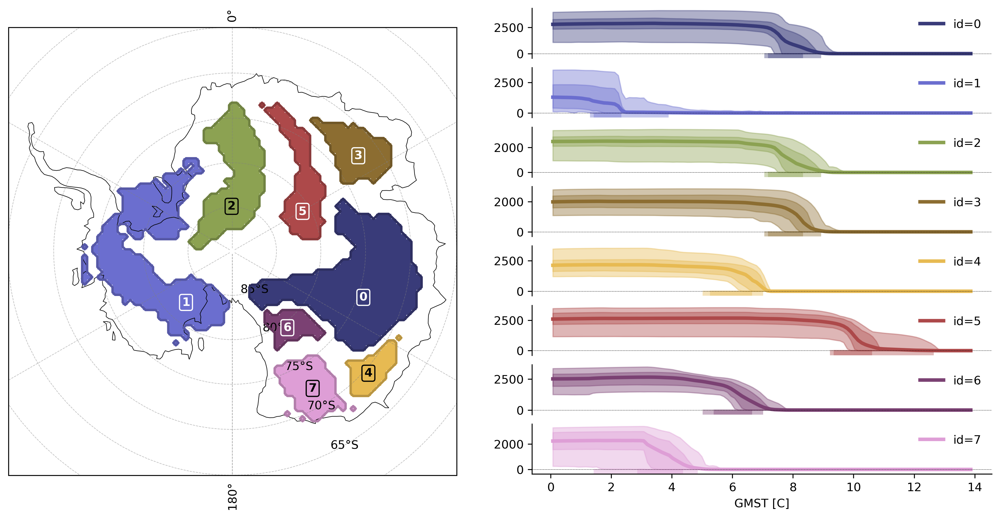

<div align="center">


# TOAD: **T**ipping and **O**ther **A**brupt events **D**etector

[](https://toad-docs.pages.dev)
[]()
[](https://github.com/tipmip-methods/toad/actions/workflows/build_and_tests.yml)
[](https://www.python.org/) [](LICENSE.txt) <br>
[](https://doi.org/10.5281/zenodo.18316437) 
[](https://github.com/astral-sh/ruff)

</div>

TOAD is a **Python** package designed for **detecting and clustering spatio-temporal patterns in gridded Earth-system  datasets**, such as model outputs. The input data should be structured as a 3D array in the format `space` × `space` × `time`, where `time` can represent actual time or some other forcing variable or bifurcation parameter. TOAD provides a streamlined pipeline for identifying and analyzing spatio-temporal regions or clusters that exhibit similar dynamical responses to external forcing.

Currently, TOAD focuses on identifying regions that experience similar abrupt transitions, such as the sudden loss of ice volume in a specific area. The goal, however, is to expand the package's functionality to support broader use cases, enabling the detection and clustering of diverse types of dynamical shifts across a wide range of systems.

The TOAD pipeline consists of three main components:

1. **Shift Detection:** Performs time series analysis at each individual grid cell to identify abrupt transitions or dynamical shifts using configurable detection methods (e.g., ASDETECT) with adjustable sensitivity parameters.
2. **Clustering:** Groups the detected shifts spatially and temporally (or along a bifurcation parameter) to reveal cohesive patterns using clustering methods (e.g., HDBSCAN) with configurable space/time scaling.
3. **Aggregation & Synthesis:** Aggregates results across multiple cluster maps from different datasets, models, variables, realisations, or methods to produce consensus clusters and statistics, and generates plots and summaries of the identified clusters for insights and interpretation.


TOAD's core functionality is exposed through the `TOAD` class, which analyzes netCDF files or xarray datasets. The primary methods - `compute_shifts`, `compute_clusters`, and `aggregate.cluster_consensus()` - handle the three main pipeline steps. The pipeline supports aggregation of results across multiple runs, enabling consensus-based analysis. Additional helper functions and visualization tools make it easy to explore and understand the results.


## Installation

Until TOAD is published on pip/conda you can install it like this:

```bash
$ git clone https://github.com/tipmip-methods/toad.git
$ cd toad
$ pip install .
```

### Simple use case

```python
from toad import TOAD
from toad.shifts import ASDETECT
from sklearn.cluster import HDBSCAN


# init TOAD object with ice-thickness field and a custom time dimension.
td = TOAD("ice_thickness.nc", time_dim="GMST")

# Compute shifts for variable 'thk' using the method ASDETECT (Boulton & Lenton, 2019)
td.compute_shifts("thk", method=ASDETECT())

# Compute clusters using HDBSCAN from scikit-learn (McInnes, 2017)
td.compute_clusters(
    var="thk",
    method=HDBSCAN(min_cluster_size=10),
    time_weight=1.5,
)

# Plot largest clusters in ccrs.SouthPolarStereo() projection
td.plot.overview("thk", map_style={"projection": "south_pole"})
```

<div align="center">
    
</div>

For more details, check out the tutorials.

## Tutorials

- [Basics](https://github.com/tipmip-methods/toad/blob/main/tutorials/basics.ipynb): Learn the core concepts and workflow
- [Visualization](https://github.com/tipmip-methods/toad/blob/main/tutorials/visualisation_examples.ipynb): Explore the plotting capabilities
- [Custom Clustering](https://github.com/tipmip-methods/toad/blob/main/tutorials/clustering_methods.ipynb): Implement your own clustering methods
- [Custom Shift Detection](https://github.com/tipmip-methods/toad/blob/main/tutorials/shift_detection_methods.ipynb): Create new shift detection algorithms

## Development

```bash
$ git clone https://github.com/tipmip-methods/toad.git
$ cd toad
$ pip install -e .[dev]
```

The `-e` flag installs the package in "editable" mode, which means changes to the source code are immediately reflected without needing to reinstall.

For more information on contributing, code formatting, and our development workflow, see [CONTRIBUTING.md](CONTRIBUTING.md).

## Citation

If you use TOAD in your research, please cite:

**TOAD package:**
Harteg, J., Roehrich, L., De Maeyer, K., Garbe, J., Sakschewski, B., Klose, A. K., Donges, J., Winkelmann, R., and Loriani, S.: TOAD: Tipping and Other Abrupt events Detector, Zenodo, https://doi.org/10.5281/zenodo.18316437, 2026.

*Note: This DOI always points to the latest release version.*

**TOAD methodology paper (submitted):**
Harteg, J., Roehrich, L., De Maeyer, K., Garbe, J., Sakschewski, B., Klose, A. K., Donges, J., Winkelmann, R., and Loriani, S.: TOAD v1.0: A Python Framework for Detecting Abrupt Shifts and Coherent Spatial Domains in Earth-System Data, Geosci. Model Dev., submitted, 2026.

## License

TOAD is licensed under the BSD 2-Clause License. See [LICENSE.txt](LICENSE.txt) for details.

## References

- Boulton, C. A., & Lenton, T. M. (2019). A new method for detecting abrupt shifts in time series. F1000Research, 8, 746. [https://doi.org/10.12688/F1000RESEARCH.19310.1](https://doi.org/10.12688/F1000RESEARCH.19310.1)
- McInnes, L., Healy, J., & Astels, S. (2017). hdbscan: Hierarchical density based clustering. J. Open Source Softw., 2(11), 205. [https://doi.org/10.21105/joss.00205](https://doi.org/10.21105/joss.00205)
- The scikit-learn developers. (2025). scikit-learn. Zenodo. [https://doi.org/10.5281/zenodo.591564](https://doi.org/10.5281/zenodo.591564)
