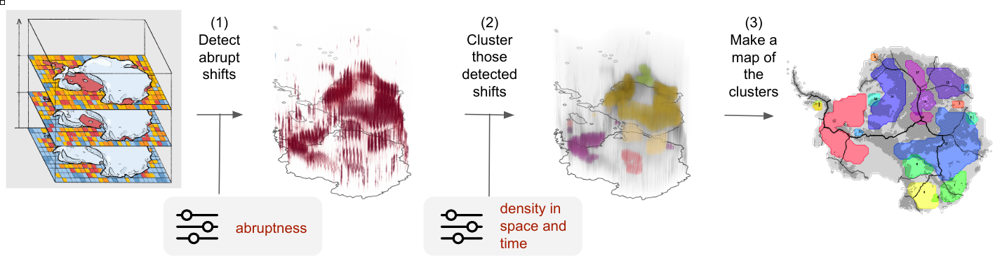

# TOAD

**T**ipping and **O**ther **A**brupt events **D**etector.

Documentation: [toad-docs.pages.dev](https://toad-docs.pages.dev/)

## Installation

Until TOAD is published on pip/conda you can install it like this:

```bash
$ git clone https://github.com/tipmip-methods/toad.git
$ cd toad
$ pip install .
```

## What is TOAD?

TOAD is a Python package designed for detecting and clustering spatio-temporal patterns in 3D datasets, such as model outputs. The input data should be structured as a 3D array in the format `space` × `space` × `time`, where `time` can represent actual time or some other forcing variable or bifurcation parameter. TOAD provides a streamlined pipeline for identifying and analyzing spatio-temporal regions or clusters that exhibit similar dynamical responses to external forcing.

Currently, TOAD focuses on identifying regions that experience similar abrupt transitions, such as the sudden loss of ice volume in a specific area. The goal, however, is to expand the package's functionality to support broader use cases, enabling the detection and clustering of diverse types of dynamical shifts across a wide range of systems.

The TOAD pipeline consists of three main components:

1. **Shift Detection:** Performs time series analysis at each individual grid cell to identify abrupt transitions or dynamical shifts.
2. **Clustering:** Groups the detected shifts spatially and temporally (or along a bifurcation parameter) to reveal cohesive patterns.
3. **Synthesis:** Generate plots and summaries of the identified clusters, facilitating insights and interpretation of the results.

<div align="center">
    
</div>

TOAD's core functionality is exposed through the `TOAD` class, which analyzes netCDF files or xarray datasets. The two primary methods - `compute_shifts` and `compute_clusters` - handle the main analysis steps. Additional helper functions and visualization tools make it easy to explore and understand the results.

### Simple use case

```python
from toad import TOAD
from toad.shifts import ASDETECT
from sklearn.cluster import HDBSCAN


# init TOAD object with Global Mean Surface Temperature as custom "time" dimension
td = TOAD("ice_thickness.nc", time_dim="GMST")

# Compute shifts for variable 'temp' using the method ASDETECT (Boulton & Lenton, 2019)
td.compute_shifts("thk", method=ASDETECT())

# Compute clusters for points that have shifts larger than 0.9 using HDBSCAN (McInnes, 2017)
td.compute_clusters(
    var="thk",
    method=HDBSCAN(min_cluster_size=10),
    time_weight=1.5,
)

# Plot 8 largest clusters in ccrs.SouthPolarStereo() projection
td.plot.overview("thk", cluster_ids=range(8), map_style={"projection": "south_pole"})
```

<div align="center">
    
</div>

For more details, check out our tutorials:

- [Basics](https://github.com/tipmip-methods/toad/blob/main/tutorials/basics.ipynb): Learn the core concepts and workflow
- [Visualization](https://github.com/tipmip-methods/toad/blob/main/tutorials/visualisation_examples.ipynb): Explore the plotting capabilities
- [Custom Clustering](https://github.com/tipmip-methods/toad/blob/main/tutorials/clustering_methods.ipynb): Implement your own clustering methods
- [Custom Shift Detection](https://github.com/tipmip-methods/toad/blob/main/tutorials/shift_detection_methods.ipynb): Create new shift detection algorithms

## Development

```bash
$ git clone https://github.com/tipmip-methods/toad.git
$ cd toad
$ pip install -e .[dev]
```

The `-e` flag installs the package in "editable" mode, which means changes to the source code are immediately reflected without needing to reinstall.

We encourage using [ruff](https://github.com/astral-sh/ruff) for consistent code formatting across the project.

### Pre-commit hooks

To ensure consistent code formatting and quality, we use pre-commit hooks. After installing the dev dependencies, install the pre-commit hooks:

```bash
$ pre-commit install
```

The hooks will automatically run on each commit, checking and fixing code formatting with ruff. If you want to manually run the hooks on all files:

```bash
$ pre-commit run --all-files
```

## Repository information

We use [trunk-based development](https://medium.com/@vafrcor2009/gitflow-vs-trunk-based-development-3beff578030b)
for our git workflow. This means we all work on the same branch (main), the
trunk, and push our code changes to it often. This way, we can keep our code up
to date. We also avoid having too many branches that can get messy and hard to
merge. We only create short-lived branches for small features or bug fixes, and
we merge them back to main as soon as they are done. To this end, each developer
issues pull-requests that are approved or rejected by the maintainer. Special
versions of the code can be then dedicated releases with version tags, allowing
others to use very specific versions of the code if needed.

---

## References

- Boulton, C. A., & Lenton, T. M. (2019). A new method for detecting abrupt shifts in time series. F1000Research, 8, 746. [https://doi.org/10.12688/F1000RESEARCH.19310.1](https://doi.org/10.12688/F1000RESEARCH.19310.1)
