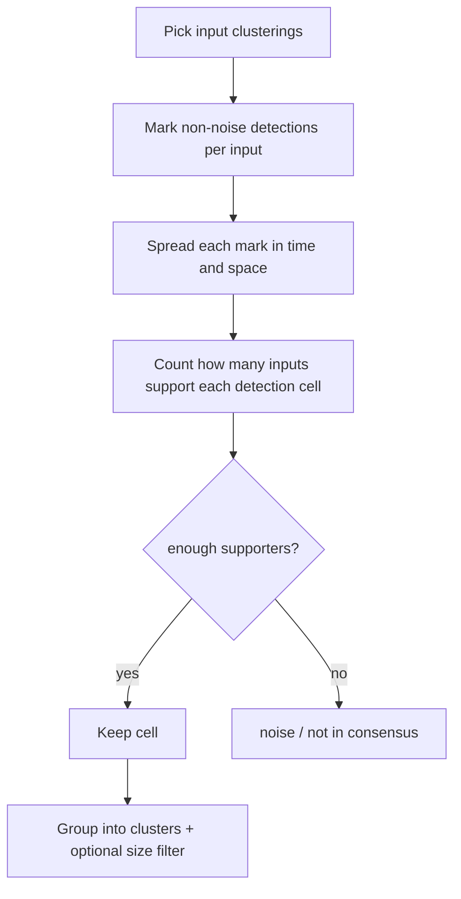

# Spacetime consensus clustering

You have several cluster maps from different runs, models, or parameter choices — all on the same time × space grid. Consensus asks a simple question: **where did multiple clusterings agree that something happened?**

`td.compute_consensus()` answers that with a **member-support** algorithm: it builds one combined label field (plus a companion **rate** field) and stores both in `td.data`.

For a worked example with plots, see the {doc}`Consensus tutorial <tutorials/consensus>`.

## The idea in one pass

1. Look at each input clustering and mark every **native event voxel** where a real cluster was found (not noise, not “no shift”).
2. For each input, **spread** that mark slightly in time and space — so a detection nearby still counts as support.
3. At each native detection cell, count **how many inputs** would support it after that spreading.
4. Keep the cell only if enough inputs agree (your `min_consensus` threshold).
5. Group kept cells into consensus clusters (again using your tolerances), optionally drop tiny clusters, and write the result.

Nothing is added to the output just because it appeared in the dilated “support zone” — only voxels that were **actually detected** in at least one input can appear in the consensus labels.

## Quick reference

| | |
| --- | --- |
| **You need** | Two or more input cluster variables for meaningful agreement (`cluster_vars=None` uses all `td.cluster_vars`). Labels: cluster id ≥ 0, `-1` = noise, `NaN` = no abrupt shift. |
| **You must set** | `min_consensus`, `temporal_tolerance`, `spatial_tolerance` |
| **You get** | Consensus labels (default `cluster_consensus`) and rate (`cluster_consensus_rate`). Per-cluster table: `td.aggregate.consensus_summary()`. |

```python
td.compute_consensus(
    cluster_vars=None,
    min_consensus=0.75,
    temporal_tolerance=5,
    spatial_tolerance=1,
    stitch_meridian="auto",
    min_cluster_area=2,
    show_progress=True,
)
```

## How it works



### Step by step

**1. One mask per input.** Each clustering becomes a yes/no map: “was a cluster assigned here?” Noise (`-1`) and no-shift cells (`NaN`) are ignored.

**2. Spread for support counting.** Each yes/no map is dilated in `(time, y, x)`. If input A found something at year 1998, it can support a detection at 2000 when `temporal_tolerance=2`. Same idea in space with `spatial_tolerance`. On global longitude grids, `stitch_meridian` can connect the first and last column during this step (and during labelling).

**3. Count supporters.** At every cell that **is** a detection in at least one input, count how many inputs have dilated support covering that cell.

**4. Apply your threshold.**

```python
min_votes = max(1, ceil(min_consensus * n_inputs))
```

Examples with five inputs: `0.5 → 3`, `0.75 → 4`, `1.0 → 5`. With only two inputs, `0.5` means a single supporter is enough — use `1.0` if you want both to agree.

**5. Label consensus clusters.** Kept cells are connected into clusters using the same tolerances (`max(1, tolerance)` along each axis, so `0` still links immediate neighbours). The output contains **only** kept detection cells, not dilated padding.

**6. Optional size filter (`min_cluster_area`).** Remove clusters whose spatial footprint (distinct cells labelled at any time) is below the threshold. Default `2` drops single-cell clusters; `None` turns this off. Remaining cluster ids are re-sorted (largest → 0, …). The rate field is unchanged by this filter.

## Reading the output

### Labels (`variable_type=consensus_cluster`)

| Value | Meaning |
| --- | --- |
| `NaN` | No input saw an abrupt shift here |
| `-1` | At least one input saw something, but this cell did not make consensus (or was filtered out) |
| `0, 1, 2, …` | Consensus cluster id |

### Rate (`variable_type=consensus_rate`)

Companion field `{label_name}_rate` (default `cluster_consensus_rate`): at each **native event voxel**, supporting inputs divided by total inputs. Values are in `[0, 1]`.

- Reported even on voxels **below** the consensus cut-off — useful for “almost consensus” regions.
- `0` where no input assigned a cluster at that cell.
- `NaN` where the label is `NaN`.

Plot with `td.plot.consensus_rate_map()`.

### Stored metadata

Both label and rate arrays store `consensus_method` (`"member_support"`), `cluster_vars`, `min_consensus`, `min_consensus_members` (the `min_votes` used), tolerances, `stitch_meridian` (what you passed), and `stitch_meridian_applied` (what actually ran).

## Parameters

| Parameter | What it does |
| --- | --- |
| `min_consensus` | Fraction of inputs that must support a cell for it to be kept |
| `temporal_tolerance` / `spatial_tolerance` | How far support and cluster connectivity can reach in time steps and grid cells (not km). `0` = exact-time or exact-cell support only. |
| `stitch_meridian` | `"auto"` (default): stitch seam on near-global grids; `False` for regional domains; `True` to force |
| `min_cluster_area` | Drop clusters smaller than this spatial footprint; default `2`, `None` disables |
| `show_progress` | Progress bar while processing inputs; default `True` |
| `output_label`, `output_label_suffix`, `overwrite` | Naming — same rules as `compute_clusters` |

## After consensus

| Goal | API |
| --- | --- |
| Per-cluster overview table | `td.aggregate.consensus_summary()` — area, `mean_consensus_rate`, shift-time columns |
| Map of member-support fractions | `td.plot.consensus_rate_map()` |
| Overlay input trajectories on one consensus cluster | `td.aggregate.consensus_cluster_timeseries(da_clusters, cluster_id)` — looser spatial/time rule than the summary |
| Shift-time samples / violin plots | `td.aggregate.consensus_shift_time_distribution(da_clusters)` |
| Time-collapsed “ever clustered here?” hotspot map | `td.aggregate.cluster_occurrence_rate()` — **not** spacetime consensus; no timing agreement required |