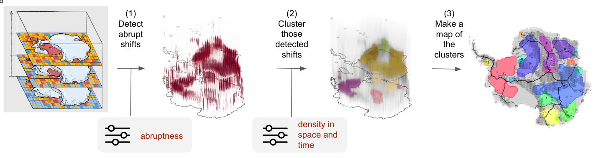

.. TOAD documentation master file, created by
   Lukas Röhrich, November 2023

Home
====

**TOAD** (**T**\ ipping and **O**\ ther **A**\ brupt events **D**\ etector) is a Python framework for detecting and clustering spatio-temporal patterns in gridded Earth-system datasets. It is presented in detail in Harteg et al. (2026), available as a `preprint on EGUsphere <https://doi.org/10.5194/egusphere-2026-356>`_.

.. note::
   For general information, project overview, and the latest updates, visit the `TOAD GitHub repository <https://github.com/tipmip-methods/toad>`_.

   If you're new to TOAD, start with the :doc:`installation` guide and then follow the :doc:`quick_start` tutorial.

.. raw:: html

   

     <iframe src="https://www.loom.com/embed/75e9996d5dbb47269934548fbed3b320" frameborder="0" webkitallowfullscreen mozallowfullscreen allowfullscreen style="position: absolute; top: 0; left: 0; width: 100%; height: 100%;"></iframe>
   

What's in this documentation?
------------------------------

This documentation provides comprehensive guides for using TOAD in your research:

* :doc:`installation` - Installation instructions for different environments
* :doc:`quick_start` - Get started with TOAD in minutes
* :doc:`tutorials` - Detailed tutorials covering core concepts and advanced usage
* :doc:`consensus_clustering` - Spacetime consensus clustering algorithm and parameters (:doc:`hands-on tutorial <tutorials/consensus>`)
* :doc:`api_ref` - Complete API reference for all classes and functions
* :doc:`scientific_ref` - Scientific references and methodology details
* :doc:`release_notes` - Version history and changelog

The TOAD Pipeline
------------------

TOAD provides a structured workflow for analyzing Earth-system data:

1. **Shift Detection**: Identify abrupt transitions at individual grid cells using configurable detection methods
2. **Clustering**: Group detected shifts spatially and temporally to reveal cohesive patterns
3. **Aggregation & Synthesis**: Aggregate results across multiple datasets, models, or methods to produce consensus clusters — see :doc:`consensus_clustering` and the :doc:`Consensus tutorial <tutorials/consensus>`

About
-----

TOAD is developed at the `Potsdam Institute for Climate Impact Research (PIK) <https://www.pik-potsdam.de/en>`_ and the `Max Planck Institute of Geoanthropology <https://www.gea.mpg.de/>`_. The project originated from early prototype work by `Sina Loriani <https://www.pik-potsdam.de/members/sinal>`_ in 2022. Since 2024, `Jakob Harteg <https://www.pik-potsdam.de/members/jakobha>`_ has led the full development of the package as part of his PhD project. Over time, numerous contributors have played important roles at various stages, including `Lukas Röhrich <https://www.pik-potsdam.de/members/lukasro>`_ and `Fritz Kühlein <https://www.pik-potsdam.de/members/fritzku/homepage>`_. The project has also benefited greatly from scientific advice and guidance from `Sina Loriani <https://www.pik-potsdam.de/members/sinal>`_, `Jonathan Donges <https://www.pik-potsdam.de/members/donges>`_, `Ricarda Winkelmann <https://www.pik-potsdam.de/members/ricardaw>`_, and many others. Community contributions, such as feature suggestions, bug reporting, or even extensions like new detection algorithms, are very welcome.

Getting Help
------------

* **Documentation**: Browse the sections above or use the search function
* **GitHub Issues**: Report bugs or request features on `GitHub <https://github.com/tipmip-methods/toad/issues>`_
* **Source Code**: View the `source code <https://github.com/tipmip-methods/toad>`_ on GitHub
